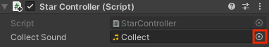

Geluiden worden gebruikt om de spelerservaring te verbeteren. Om een geluid toe te voegen, maak een public variabele om het geluid op te slaan dat je wilt afspelen:

--- code ---
---
language: cs
---

public AudioClip collectSound;

--- /code ---

Voeg een regel code toe op het punt waar je het geluid wilt afspelen:

--- code ---
---
language: cs
---

AudioSource.PlayClipAtPoint(collectSound, transform.position);

--- /code ---

Deze code speelt bijvoorbeeld een geluid wanneer het GameObject wordt verzameld door de speler:

--- code ---
---
language: cs
---

public AudioClip collectSound;

void OnTriggerEnter(Collider other)
{
    // Check the tag of the colliding object
    if (other.gameObject.tag == "Player")
    {
        AudioSource.PlayClipAtPoint(collectSound, transform.position);
        Destroy(gameObject);
    }
}

--- /code ---

Zoek in de Unity editor, de geluidseigenschappen voor het script component en klik op de cirkel om het geluid toe te wijzen dat je wilt afspelen:

